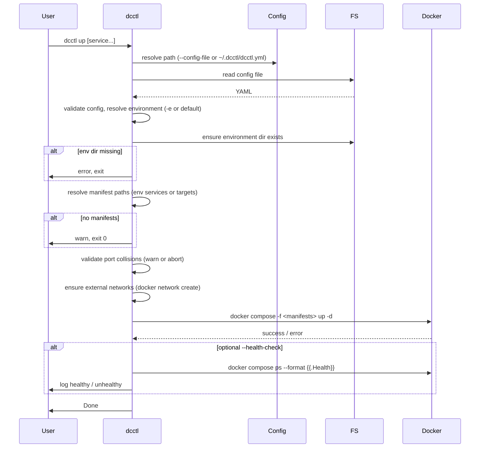

# Sequence: Config load and up

From `dcctl up` (or `dcctl up <service>`): load config, resolve environment and manifest paths, ensure external networks, run docker compose up.

```mermaid
sequenceDiagram
    participant User
    participant dcctl
    participant Config
    participant FS
    participant Docker

    User->>dcctl: dcctl up [service...]
    dcctl->>Config: resolve path (--config-file or ~/.dcctl/dcctl.yml)
    dcctl->>FS: read config file
    FS-->>dcctl: YAML
    dcctl->>dcctl: validate config, resolve environment (-e or default)
    dcctl->>FS: ensure environment dir exists
    alt env dir missing
        dcctl->>User: error, exit
    end
    dcctl->>dcctl: resolve manifest paths (env services or targets)
    alt no manifests
        dcctl->>User: warn, exit 0
    end
    dcctl->>dcctl: validate port collisions (warn or abort)
    dcctl->>dcctl: ensure external networks (docker network create)
    dcctl->>Docker: docker compose -f <manifests> up -d
    Docker-->>dcctl: success / error
    alt optional --health-check
        dcctl->>Docker: docker compose ps --format {{.Health}}
        dcctl->>User: log healthy / unhealthy
    end
    dcctl->>User: Done
```
