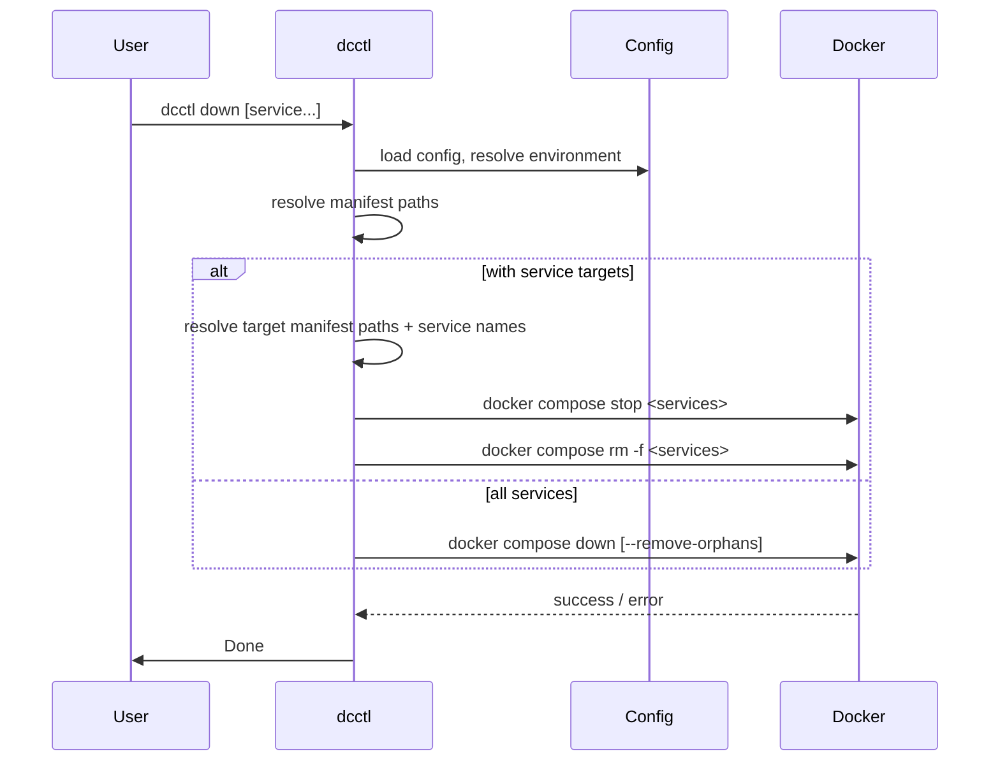

# Sequence: Down and cleanup

From `dcctl down` (all services) or `dcctl down <service...>` (targeted stop + rm): load config, resolve manifests and target services, run compose stop/rm or down.

```mermaid
sequenceDiagram
    participant User
    participant dcctl
    participant Config
    participant Docker

    User->>dcctl: dcctl down [service...]
    dcctl->>Config: load config, resolve environment
    dcctl->>dcctl: resolve manifest paths
    alt with service targets
        dcctl->>dcctl: resolve target manifest paths + service names
        dcctl->>Docker: docker compose stop <services>
        dcctl->>Docker: docker compose rm -f <services>
    else all services
        dcctl->>Docker: docker compose down [--remove-orphans]
    end
    Docker-->>dcctl: success / error
    dcctl->>User: Done
```
