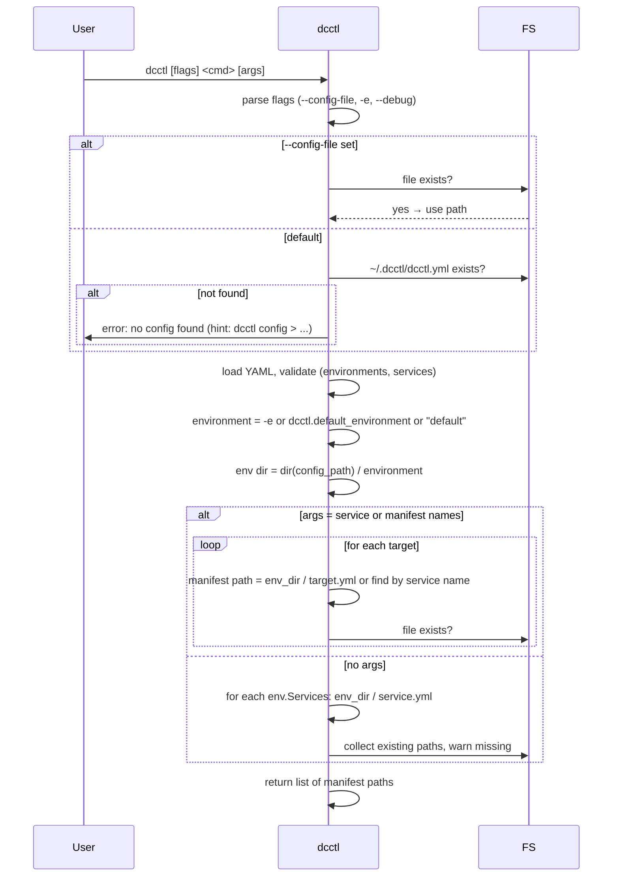

# Sequence: Manifest resolution

How dcctl resolves the config file path, the selected environment, and the list of manifest file paths (per-environment services or explicit targets). **Config path:** dcctl uses only `--config-file` if set, otherwise **only** `~/.dcctl/dcctl.yml` (it does not look in the current directory).

