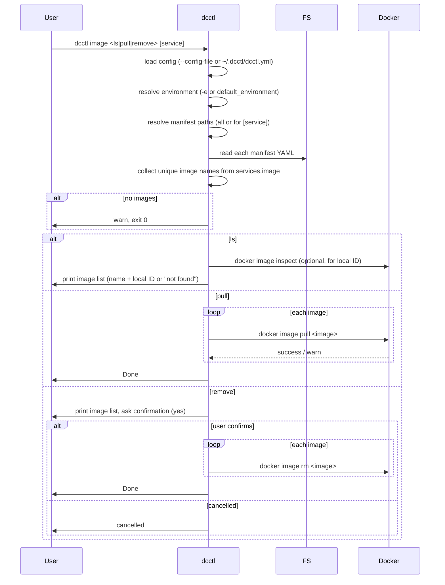

# Sequence: Image (ls, pull, remove)

From `dcctl image ls [service]`, `dcctl image pull [service]`, or `dcctl image remove [service]`: load config for the current environment, resolve manifest paths (all or for the given service), collect image names from those manifests, then list them, pull them, or remove them (with confirmation).

Same manifest resolution as other commands (see [03-manifest-resolution](./03-manifest-resolution.md)); images are taken from the `image:` field of each service in the resolved compose files.

