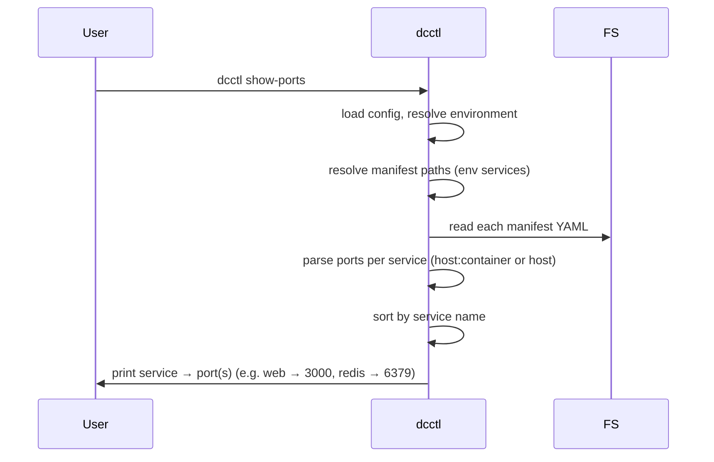

# Sequence: Show ports

From `dcctl show-ports`: load config, resolve manifest paths for the current environment, extract published ports from each compose file, and print them per service. Lets the developer see at a glance where to connect (browser, API, DB client).

Uses the same config and manifest resolution as [03-manifest-resolution](./03-manifest-resolution.md); then parses each manifest for `services.*.ports` and normalizes host:container or host-only mappings.

