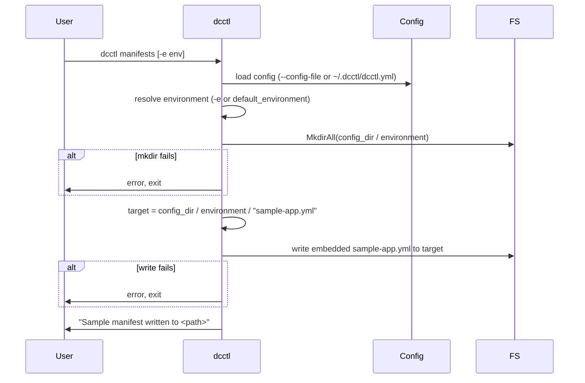

# Sequence: Manifests

From `dcctl manifests`: load config, resolve the environment (from `-e` or `default_environment`), ensure the environment directory exists, and write an embedded sample compose file (`sample-app.yml`) into that directory. Used for onboarding when the user has no manifests yet.

Config and environment resolution follow [03-manifest-resolution](./03-manifest-resolution.md). The written file is a minimal compose template so the user can rename it (e.g. to `app.yml`) and add the service name to `dcctl.environments.<env>.services`.

