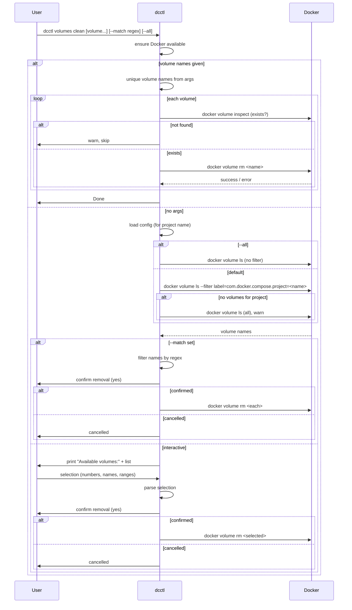

# Sequence: Volumes clean

From `dcctl volumes clean [volume...]`: optionally load config (for project name), then list Docker volumes (filtered by project label or all), let the user select which to remove (by name, by number, or via `--match` regex), ask for confirmation, and run `docker volume rm` on the selected volumes.

- **With volume names as args:** no need to list; remove those volumes (after checking they exist).
- **Without args:** list volumes (by default for the compose project from config), then either interactive selection or `--match` regex; confirm and remove.

